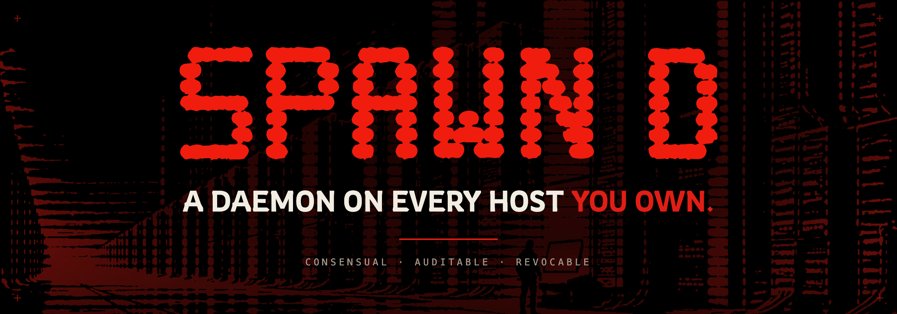
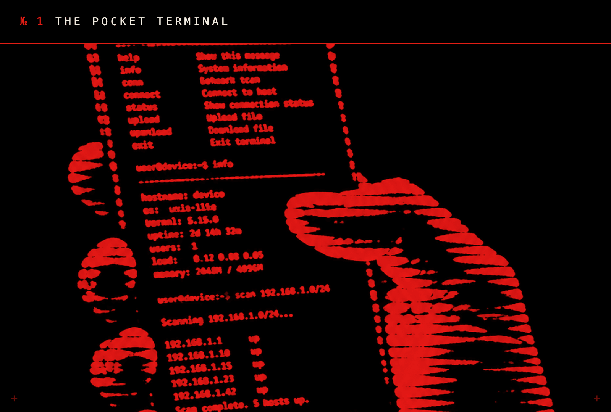
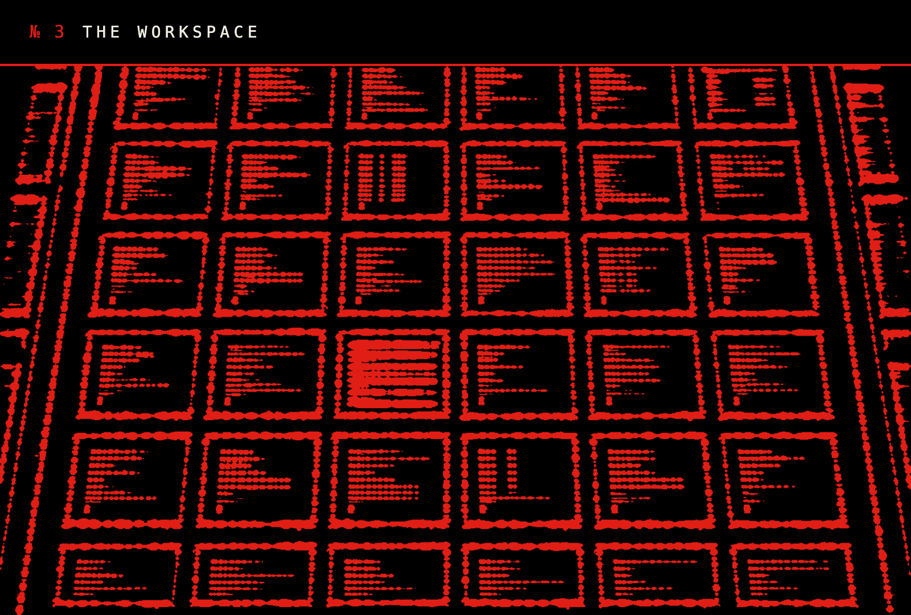
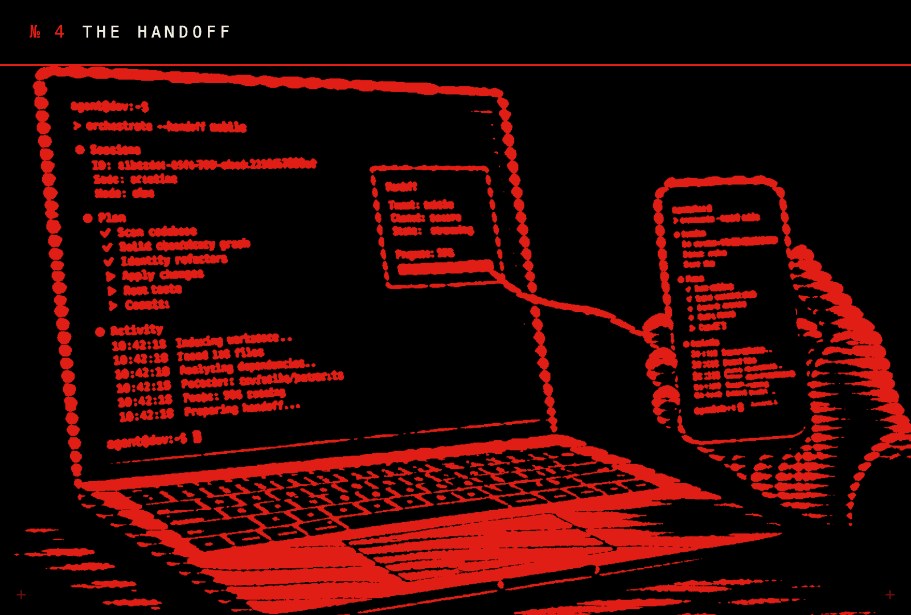
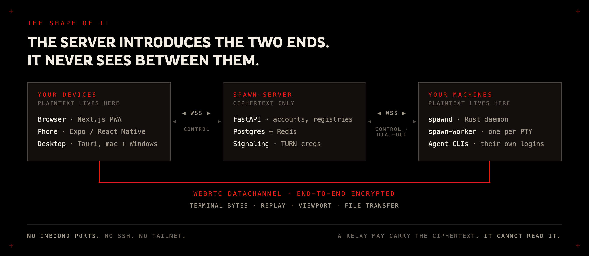

<div align="center">



<br>


<br><br>

**SPAWN D runs real shell sessions on machines you own, and hands them to you anywhere —
browser, phone, or desktop app.** Terminal bytes never touch our servers in the clear,
the daemon opens no inbound port, and every agent runs on your hardware under its own login.

</div>

```console
$ curl -fsSL https://spawnd.dev/install.sh | sh                        # macOS · Linux
PS> wsl -- bash -c "curl -fsSL https://spawnd.dev/install.sh | sh"     # Windows, via WSL
```

One line installs the daemon and walks you through the device-code login. You approve the
host against a fingerprint you can see; from then on it answers only to you.

---

## The rite

**1 · One daemon per host.**
It dials out — no inbound ports, no SSH, no tailnet — and registers the machine as yours.

**2 · Summon agents into it.**
Anything that runs in a PTY. Each agent runs on your hardware, on the subscriptions you
already pay for. SPAWN D never holds your Anthropic, OpenAI, or other provider keys.

**3 · Reach them from anywhere.**
The real terminal, in any browser, down to the one in your pocket. A second device can take
the session mid-keystroke.

The product vocabulary is deliberately small:

- A **session** is a shell PTY on a host. It starts the host user's login shell in a chosen
  directory.
- An **agent** is a launchable CLI definition — name, kind, command, environment prefix, and
  optional install command. Agent buttons are shortcuts that type visible commands into a
  session; an agent is not a process record.
- A **workspace** is a named grid of session tiles rooted in one folder on a host.
- A **host** is a paired machine running `spawnd`.

---

## The same terminal, anywhere you stand

<table>
<tr>
<td width="50%"></td>
<td width="50%"></td>
</tr>
<tr>
<td>Every session is a live PTY on your host, rendered faithfully in the browser in your pocket — not a read-only viewer.</td>
<td>Every daemon dials out to one master: no inbound ports, no SSH, no tailnet. Revoke a host and the socket dies.</td>
</tr>
<tr>
<td width="50%"></td>
<td width="50%"></td>
</tr>
<tr>
<td>A workspace is a named grid of terminal windows rooted in one folder on a host, with shells, agents, and file explorers side by side.</td>
<td>Walk away mid-command and pick the same session up on another device. It follows you mid-keystroke.</td>
</tr>
</table>

---

## It answers only to you

Terminal bytes, replay, viewport control, and session file transfers travel browser-to-daemon
over authenticated WebRTC DataChannels, end-to-end encrypted. Server WebSockets carry control,
disclosed lifecycle and activity, and signaling — never terminal content. A TURN relay may
carry the ciphertext; it cannot read it. The threat model names our own servers as the
adversary, because you should treat them as one.

```console
$ spawnd relay --attach 8f31c2
  signal      browser ⇄ daemon · introduced
  terminal    ██████████████ ciphertext only
  plaintext   never arrives
  transcript  none kept
  keys        none held, agents use their own logins

$ spawnd revoke host-07
  socket closed. it answers to no one now.
```

Read the whole argument in [docs/TRUST.md](docs/TRUST.md).

---

## The shape of it



```
web/      Next.js 15 PWA — onboarding, workspace/sidebar/settings UI, xterm.js
          terminals, and the browser side of WebRTC and host control
mobile/   Expo / React Native app — the same product on iOS and Android
desktop/  Tauri v2 companion for macOS and Windows: a local wizard that signs
          you in, installs the daemon and possesses the computer, then loads
          the web app into that same window, already signed in
server/   FastAPI control plane — accounts, host/session/workspace/agent
          registries, lifecycle, disclosed activity, signaling, TURN
          credentials, owner fencing; Postgres + Redis + Alembic
daemon/   spawnd and spawn-worker (Rust). A host dials out, so it needs no
          inbound port. Each worker owns one session's PTY and its encrypted
          bounded replay, and survives a spawnd restart
proto/    wire contracts and cross-runtime vectors shared by server, daemon
          and web, plus grid fixtures shared by server and web
infra/    local Postgres/Redis Compose services and deployment nginx examples
scripts/  deploy, health, smoke and guard scripts; test-all.sh runs the lot
docs/     design records, and docs/RELEASE.md — the release process
tools/    development utilities
```

Both frontends are clients of the same API, and neither is a port of the other: a person signs
in on the phone and picks the session up in the browser an hour later. User-facing changes ship
in both, in the same commit — see [CLAUDE.md](CLAUDE.md).

Further reading: [INTERFACE_MATRIX.md](docs/INTERFACE_MATRIX.md) and [proto/README.md](proto/README.md)
for interfaces, [DESIGN.md](docs/DESIGN.md) for UI standards, [SESSIOND.md](docs/SESSIOND.md)
for the worker model, and [TRUST.md](docs/TRUST.md) for the trust architecture.

---

## Local development

The quickstart expects Docker, Python 3.13 with `uv`, Rust stable, Node 22.19.x, Bun 1.3.14+,
`curl`, `lsof`, and PostgreSQL and Redis client tools.

```bash
docker compose -f infra/docker-compose.yml up -d
npm run dev
```

Compose creates the local `spawn` database. `npm run dev` verifies Postgres and Redis, syncs
dependencies, applies Alembic migrations, builds both Rust binaries, and starts the reloadable
web app on port 3000 and the private API on port 8010. It also starts the isolated local daemon
when that development config is already paired; otherwise it prints the exact pairing command to
run in another terminal. Rust source changes rebuild and restart `spawnd` while existing session
workers stay alive.

The command refuses to take over occupied ports, and stops only the process groups it started
when you press Ctrl-C.

Sign up in the browser, complete or skip the host step in onboarding, approve the device code at
`/device`, and create a workspace session by choosing its host and directory. The session starts
a login shell; use an agent shortcut in the terminal when you want to launch a configured CLI.

<details>
<summary><b>Running the three workspaces separately</b></summary>

```bash
# One time
cp .env.example server/.env
docker compose -f infra/docker-compose.yml up -d
```

For the browser-facing single origin, set these in `server/.env`:

```dotenv
SPAWN_PUBLIC_URL=http://localhost:3000
SPAWN_WEB_URL=http://localhost:3000
SPAWN_CORS_ORIGINS=http://localhost:3000
```

Then run each process in its own terminal:

```bash
# API: http://localhost:8000
cd server
uv sync
uv run alembic upgrade head
uv run uvicorn spawn_server.main:app --reload --port 8000 --ws websockets-sansio
```

```bash
# Web: http://localhost:3000; development proxy target defaults to :8000
cd web
bun install
bun run dev
```

```bash
# Daemon: pair once, then run in the foreground
cd daemon
cargo run --bin spawnd -- --server http://localhost:3000 login
cargo run --bin spawnd -- --server http://localhost:3000 run
```

</details>

<details>
<summary><b>Login providers</b></summary>

Email/password authentication works by default. To add Google, Microsoft, or GitHub, set the
matching `SPAWN_<PROVIDER>_CLIENT_ID` and `SPAWN_<PROVIDER>_CLIENT_SECRET` in `server/.env`, and
register this callback with the provider:

```text
${SPAWN_PUBLIC_URL}/api/auth/oauth/<provider>/callback
```

For the manual local setup above, the Google callback is
`http://localhost:3000/api/auth/oauth/google/callback`.

</details>

---

## Installing a daemon on a host

On any macOS or Linux machine that should run sessions, use the installer served by your
deployment:

```bash
curl -fsSL https://spawn.example.com/install.sh | sh
```

The script installs prerequisites where it can, downloads both prebuilt daemon binaries when
available, falls back to building from source, runs the device-code login flow, and installs a
macOS LaunchAgent or a Linux user `systemd` service where available. The hosted script defaults
to `SPAWN_PUBLIC_URL`; override it explicitly when needed:

```bash
curl -fsSL https://spawn.example.com/install.sh | sh -s -- --server https://spawn.example.com
```

Use `--prebuilt-only` in CI or smoke tests that must reject the source-build fallback. Configure
STUN/TURN with `SPAWN_WEBRTC_ICE_SERVERS`; the default is STUN-only, and TURN matters for
off-LAN, mobile, and restrictive corporate networks.

On Windows, WSL is the supported route today. A native PowerShell installer (`/install.ps1`) is
served and the daemon has been ported, but the lander only offers it once release metadata proves
the complete handoff — see [Project status](#project-status).

---

## Testing

```bash
scripts/test-all.sh
```

It runs server lint and tests, source guards, Rust tests, installer and service smokes, local
HTTP/login/daemon/browser smokes, real Redis coordination, Playwright tests, web lint and unit
tests, and the production build. Some optional checks are enabled by environment variables:

```bash
SPAWN_REMOTE_LINUX_HOST=<ssh-host> scripts/test-all.sh
SPAWN_HTTP_SMOKE_URL=https://spawnd.dev scripts/test-all.sh
SPAWN_ALLOW_REBOOT=1 SPAWN_REMOTE_REBOOT_HOST=<ssh-host> scripts/test-all.sh
```

The reboot check is deliberately gated because it reboots the remote machine. If that host
requires sudo, provide `SPAWN_SUDO_PASSWORD` for the check.

Per-workspace checks:

```bash
cd web    && npm run lint && npx tsc --noEmit
cd mobile && npm run ci
cd server && .venv/bin/ruff check . && .venv/bin/python -m pytest -q
```

---

## Production deployment

Read [docs/RELEASE.md](docs/RELEASE.md) in full before deploying anything. It is the entire
release process: what ships together, what the deploy script refuses and why, and how to verify
what actually reached production.

The supported shape is TLS termination in front of the Next.js service on `127.0.0.1:3001`, with
FastAPI private on `127.0.0.1:8001`. Next.js proxies `/api`, `/ws`, `/healthz`, and `/install.sh`,
so only the web origin needs to be public.

```bash
SPAWN_DEPLOY_HOST=spawnd-prod \
SPAWN_DEPLOY_PATH=/opt/spawn \
scripts/deploy-prod.sh
```

The deploy script fetches the current branch on the production machine, syncs and builds the
server, web app, and hosted daemon binaries, applies database migrations, and restarts the
configured services.

<details>
<summary><b>Useful overrides</b></summary>

```bash
SPAWN_DEPLOY_SERVICES="spawn-server spawn-web" scripts/deploy-prod.sh spawnd-prod
SPAWN_DEPLOY_BUILD=0 scripts/deploy-prod.sh spawnd-prod
SPAWN_DEPLOY_SUDO="" scripts/deploy-prod.sh spawnd-prod
```

</details>

---

## Session file transfers

The terminal uploads local files through the picker or drag and drop. The browser hashes and
streams bounded chunks directly to the endpoint over the locked `spawn.ctl` v1 DataChannel
protocol. Names, bytes, final paths, and detailed errors do not transit the application server.
The daemon commits files beneath the session working directory without overwriting an existing
destination. Image paste attachments stay separate, under `<cwd>/.spawn/attachments/`.

---

## Known limits

- Cookie authentication uses `SameSite=Lax` but has no separate CSRF token. Add explicit CSRF
  protection before exposing a deployment to untrusted web origins.
- Offline terminal history is intentionally unavailable. Replay belongs to a live session worker;
  the server stores no transcript.
- Agent-provider authentication is per host. Each host needs its own CLI login, such as
  `claude /login` or `codex login`.

---

## Project status

Pre-alpha. The workspace/session/agent model is implemented; its interfaces are described in
[proto/README.md](proto/README.md) and [INTERFACE_MATRIX.md](docs/INTERFACE_MATRIX.md).

Not yet proven: the native Windows daemon and desktop build compile in CI, but that lane is still
a migration scaffold rather than a required check, and nothing has been validated on real Windows
hardware. The iOS and Android store listings are not live, so the lander's store badges are
deliberately inert.

---

<div align="center">

<sub>**CONSENSUAL · AUDITABLE · REVOCABLE**</sub>

<sub>Dual-licensed under [MIT](LICENSE-MIT) or [Apache 2.0](LICENSE-APACHE), at your option.</sub>

</div>
